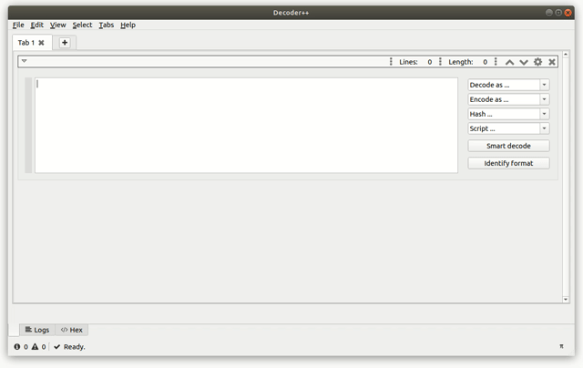

 # Decoder++


An extensible application for penetration testers and software developers to decode/encode data into various formats. 

## Usage

### Graphical User Interface

```bash
python3 dpp.py
```



### Command Line Interface

```bash
python3 dpp.py -e base64 -h sha1 "Hello, world!"
e52d74c6d046c390345ae4343406b99587f2af0d
```

### Interactive Python Shell

```bash
python3 dpp.py -i
Decoder++ 0.96
>>> DecoderPlusPlus("Hello, world!").encode().base64().hash().sha1().run()
'e52d74c6d046c390345ae4343406b99587f2af0d'
```

## Features

* Preinstalled Scripts and Codecs:
    * **Encode/Decode:** Base16, Base32, Base64, Gzip, Hex, Html, Url, Url+
    * **Hashing:** Keccak256, Md5, RipeMd160, Sha1, Sha224, Sha256, Sha348, Sha512
    * **Scripts:** Caesar, Search and Replace
* Plugin System
* Platforms:
    * Windows
    * Linux
    * MAC
* Interfaces:
    * Graphical User Interface
    * Command Line Interface
    * Interactive Python Console    

## Setup

### Manual Installation
```bash
git clone https://github.com/bytebutcher/decoder-plus-plus
cd decoder-plus-plus
pip3 install -r requirements.txt
```

### Automatic Installation
```bash
pip3 install decoder-plus-plus
```

## Advanced Usage

### Command Line Interface
```bash
usage: dpp.py [-?] [-f FILE] [-i] [-e ENCODE] [-d DECODE] [-h HASH]
              [-s SCRIPT [SCRIPT ...]]
              [input]

positional arguments:
  input                 specifies the input-text

optional arguments:
  -?, --help            show this help message and exit
  -f FILE, --file FILE  specifies the input-file
  -i, --interactive     drops into an interactive python shell
  -e ENCODE, --encode ENCODE
                        encodes the input using the specified codec(s).
  -d DECODE, --decode DECODE
                        decodes the input using the specified codec(s)
  -h HASH, --hash HASH  transforms the input using the specified hash-
                        functions
  -s SCRIPT [SCRIPT ...], --script SCRIPT [SCRIPT ...]
                        transforms the input using the specified script
                        (optional arguments)
```

### Interactive Python Console

```python
>>> # List available decoders
>>> DecoderPlusPlus("Hello, world!").decode().list()
['base16', 'base32', 'base64', 'gzip', 'hex_int', 'hex_shell', 'hex_str', 'html', 'rot13', 'url', 'urlplus']

>>> # Decode gzipped base64 string 
>>> DecoderPlusPlus("H4sIAAXmeVsC//NIzcnJ11Eozy/KSVEEAObG5usNAAAA").decode().base64().gzip().run()
'Hello, world!'
>>> # Hashing
>>> DecoderPlusPlus("Hello, world!").hash().sha1().run()
'943a702d06f34599aee1f8da8ef9f7296031d699'

```

### Plugin Development

To add custom codecs just copy them into the $HOME/.config/dpp/plugins/ folder. 

```python
from core.plugin.abstract_plugin import DecoderPlugin

class Plugin(DecoderPlugin):
    """
    Possible plugins are DecoderPlugin, EncoderPlugin, HasherPlugin or ScriptPlugin.
    See AbstractPlugin or it's implementations for more information.
    """ 

    def __init__(self, context):
        plugin_name = "URL"
        plugin_author = "Your Name"
        # Python Libraries which are required to be able to execute the run method of this plugin.
        plugin_requirements = ["urllib"]
        super().__init__(plugin_name, plugin_author, plugin_requirements)

    def run(self, text):
        # Load the required libraries here ...
        import urllib.parse
        # Run your action ...
        return urllib.parse.unquote(text)
```

## Contribute

Feel free to issue pull-requests for new features/plugins.

Thanks to 
* Tim Menapace (RIPEMD160, KECCAK256)
* Robin Krumnow (ROT13)

## Troubleshooting

### Signals are not working on Mac OS

When starting Decoder++ in Mac OS signals are not working.

This might happen when PyQt5 is installed using homebrew. To fix this issue it is recommended to install the libdbus-1
library. See http://doc.qt.io/qt-5/osx-issues.html#d-bus-and-macos for more information regarding this issue.  

### Can not start Decoder++ in Windows using CygWin

When starting Decoder++ in CygWin an error occurs:
```
  ModuleNotFoundError: No module named 'PyQt5'
```

This happens although PyQt5 is installed using pip. Currently there is no fix for that. Instead it is recommended
to start Decoder++ using the Windows Commandline.

## Inspired By
* PortSwigger's Burp Decoder

## Powered By
* PyQt5
* QtAwesome
* QScintilla
