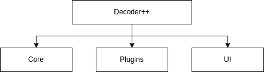
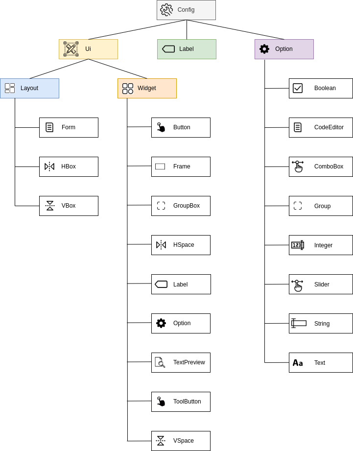
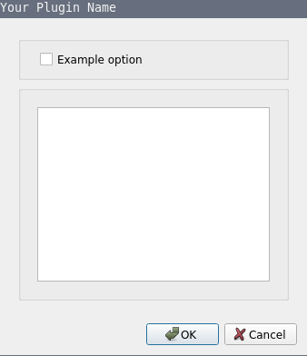
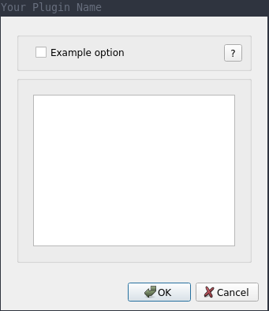

# Development Guide

This guide provides an overview how Decoder++ sourc. 

## Architecture
The source code of Decoder++ is structured into three parts: 
- **core:** contains basic functionality.
- **plugins:** uses the core and extends the basic functionality with encoders, decoders and scripts.
- **ui:** uses the core and the plugins. Displays the graphical representation of Decoder++ using Qt.



### Core

The core contains the basic functionality of Decoder++. The most important parts are:
- **context:** Access to often used functionalities like configuration and plugins.
  Interaction with this class should be limited to minimize dependencies.
- **config:** Persistent main configuration of Decoder++ for storing keyboard shortcuts, window position, etc.  
- **plugin:** Logic for loading, defining and accessing the plugins. 

### Plugin 

The following code shows a basic example how a plugin may look like:
```python
from dpp.core.plugin import DecoderPlugin

class Plugin(DecoderPlugin):
    """
    Possible plugins are DecoderPlugin, EncoderPlugin, HasherPlugin, ScriptPlugin or IdentifyPlugin.
    See AbstractPlugin or it's implementations for more information.
    """

    def __init__(self, context):
        super().__init__(
            name='URL',
            author='Your Name',
            # Python libraries which are required for executing the run method of this plugin.
            dependencies=["urllib"],
            context=context
        )

    def run(self, text):
        # Load the required libraries here ...
        import urllib.parse
        # Run your action ...
        return urllib.parse.unquote(text)
```
To add custom plugins just copy the plugin file into the ```$HOME/.config/dpp/plugins/``` folder.

#### Configuration

The configuration of a plugin is divided into configuration options and the configuration view.
An overview of the available classes and the hierarchical structure can be seen in the following figure:



The following example shows how to add configuration options to a plugin:

```python
from dpp.core.plugin import DecoderPlugin
from dpp.core.plugin.config import Label
from dpp.core.plugin.config.options import Boolean


class Plugin(DecoderPlugin):

    class Option:
        ExampleOption = Label('example_option', 'Example option')

    def __init__(self, context):
        super().__init__(
            name='Your Plugin Name',
            author='Your Name',
            # Python libraries which are required for executing the run method of this plugin.
            dependencies=["urllib"],
            context=context
        )
        self.config.add(Boolean(
            label=Plugin.Option.ExampleOption,
            value=False,
            description="An example option (default=False)",
            is_required=False
        ))

    def run(self, text):
        if self.config.value(Plugin.Option.ExampleOption):
            # Run your action ...
            return ''
        else:
            # Run your action ...
            return ''
```

The code above automatically registers the configuration options to the CLI and the GUI
which allows to automatically generate a configuration dialog:



While the automatically generated configuration dialog is often good enough
the layout can be customized. 

The following code shows an example of how the layout can be customized:
```python
from qtpy.QtCore import QUrl
from qtpy.QtGui import QDesktopServices

from dpp.core.plugin import DecoderPlugin
from dpp.core.plugin.config import Label
from dpp.core.plugin.config.options import Boolean
from dpp.core.plugin.config.ui import Layout
from dpp.core.plugin.config.ui.layouts import FormLayout, HBoxLayout
from dpp.core.plugin.config.ui.widgets import ToolButton, Frame, Option


class Plugin(DecoderPlugin):

    class Option:
        ExampleOption = Label('example_option', 'Example option')

    def __init__(self, context):
        super().__init__(
            name='Your Plugin Name',
            author='Your Name',
            # Python libraries which are required for executing the run method of this plugin.
            dependencies=["urllib"],
            context=context
        )
        self.config.add(Boolean(
            label=Plugin.Option.ExampleOption,
            value=False,
            description="An example option (default=False)",
            is_required=False
        ))

    def layout(self, input_text: str) -> Layout:
        return FormLayout(
            widgets=[
                Frame(
                    layout=HBoxLayout(
                        widgets=[
                            Option(self._config.option(Plugin.Option.ExampleOption)),
                            ToolButton(
                                label='?',
                                on_click=lambda evt: QDesktopServices.openUrl(QUrl("https://example.com/"))
                            )
                        ]
                    )
                )
            ]
        )

    def run(self, text):
        if self.config.value(Plugin.Option.ExampleOption):
            # Run your action ...
            return ''
        else:
            # Run your action ...
            return ''
```

This will generate the following configuration dialog:



### UI

The UI contains the code for displaying the graphical user interface of Decoder++ by making use of the core 
functionality and the plugins. The package is separated into the following sub packages:
- **widget:** Core widgets with the emphasis of decoupling them from Decoder++ for allowing them to be used
              in other projects as well.
- **builder:** Helpers for building common objects.
- **dialog:** Code for all Decoder++ dialogs.
- **dock:** Dock widgets e.g. logging, hex, etc.
- **view:** Code for different views of Decoder++ e.g. classic/modern. 
